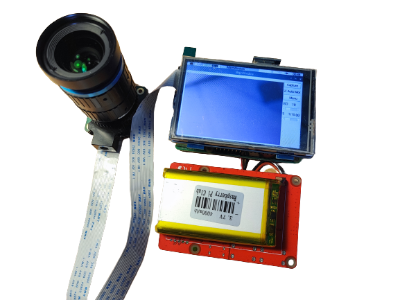
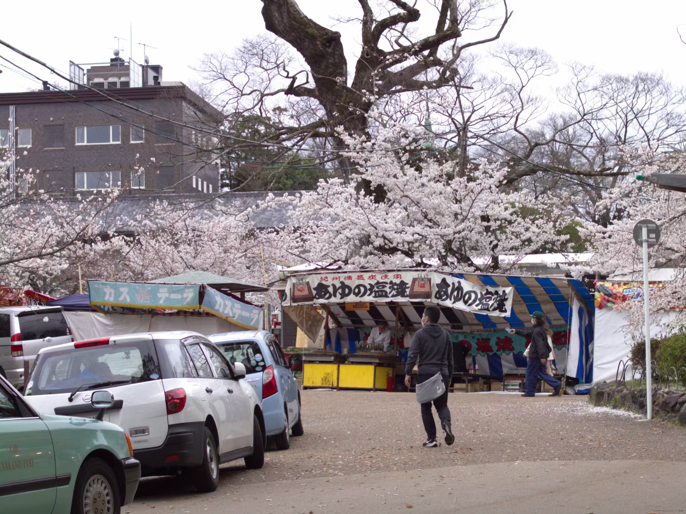
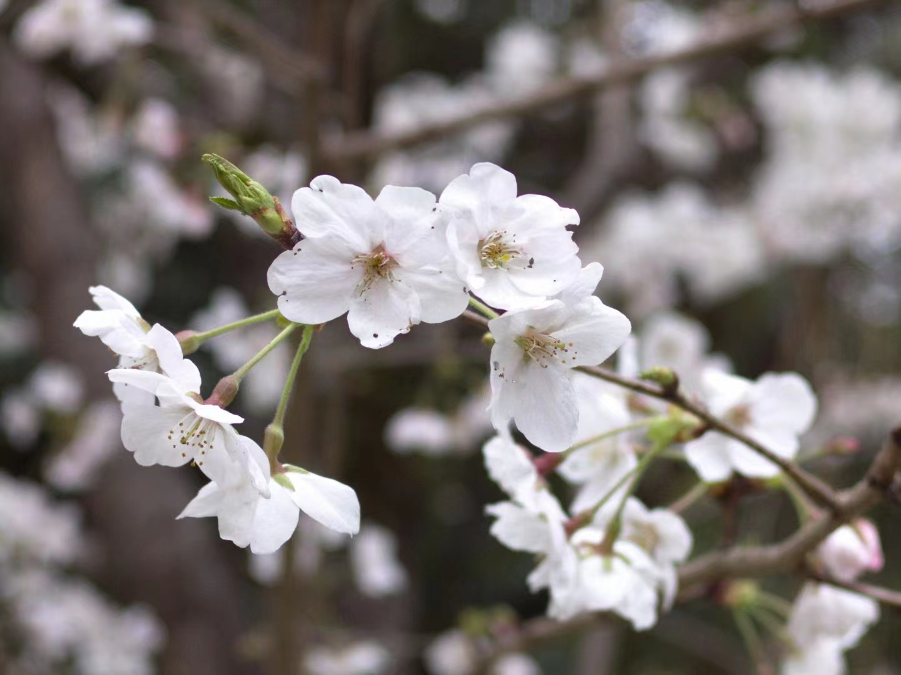
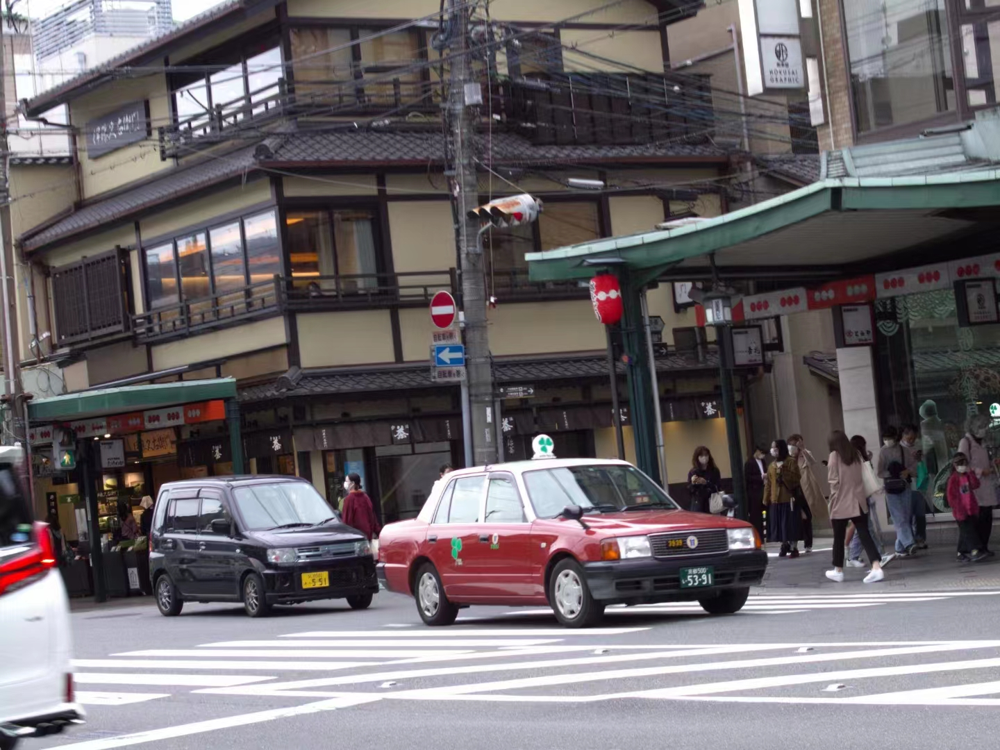
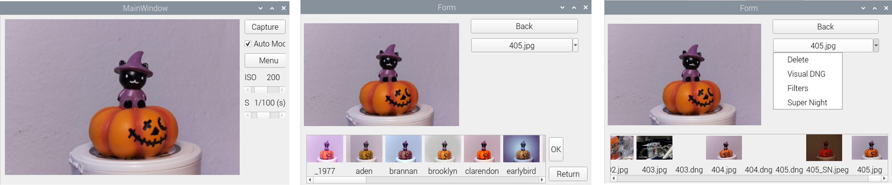

# A solution for portable Raspberry Pi digital camera.
A portable Raspberry Pi digital camera solution combining hardware (Camera, Screen, Battery) and software (Qt GUI, Ins Filters, Super Night Vision).

---

### Gallery

---

### Software
- GUI: Qt5
- Filters: [pilgram](https://github.com/akiomik/pilgram)(A python library for instagram filters.)
- Super Night Vision: A  deep learning low light denoising model: [SID](https://arxiv.org/abs/1805.01934) pytorch implementation.

### Hardware
- Camera: [Raspberry Pi High Quality Camera](https://www.raspberrypi.com/products/raspberry-pi-high-quality-camera/)
- Screen: ELECROW AJP70043E
- Battery: MakerFocus B01LAEX7J0

